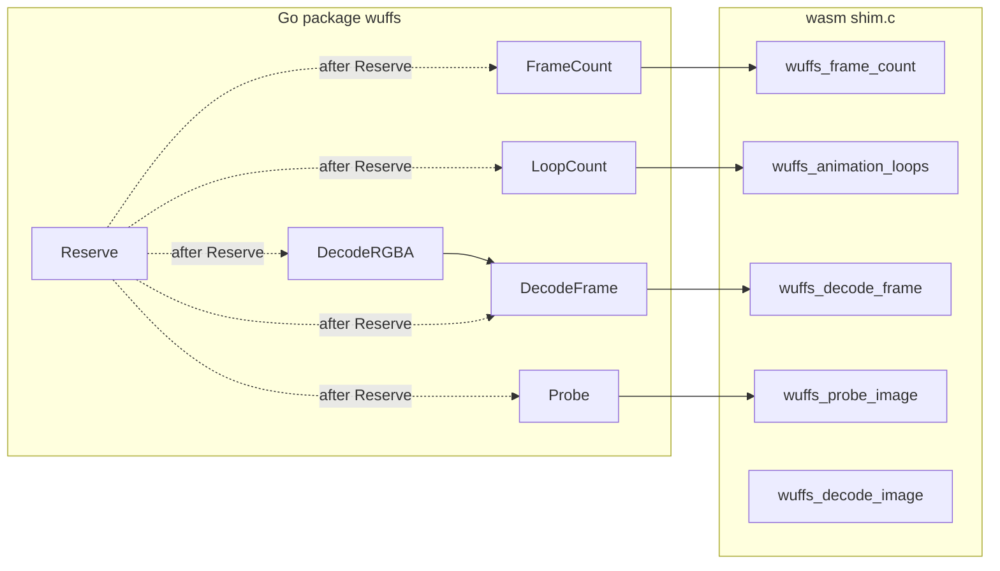

# Developer Guide

This document explains how to build, test, and hack on `wuffs-go`.

## Performance comparison

Wuffs-go PNG benchmarks are paired with `image/png` stdlib benchmarks so
throughput can be compared on the same machine. All use the same compressed
input bytes for an apples-to-apples source-throughput comparison.

```bash
# Run all four PNG benchmarks (2 wuffs + 2 stdlib).
go test -bench='PNG_' -benchmem -count=5 -run=^$

# Run the baseline record test (logs both wuffs and stdlib throughput).
go test -v -run TestBenchmarkPNGBaselineRecord -count=1
```

**Interpreting output:**

- `BenchmarkStdlibPNG_*` uses `image/png.Decode` — more allocs (full decode
  allocation), but well-optimized native code.
- `BenchmarkDecodeRGBA_PNG_*` uses the wuffs wasm guest via wasm2go —
  zero allocs on the hot path (the `image.RGBA` and guest scratch are
  allocated **once** outside `b.ResetTimer` and reused for every iteration),
  but wasm execution overhead remains.
- Go/no-go on the wasm2go path remains a manual human decision; no
  automated perf gate is enforced.

## Allocation model

`DecodeRGBA` writes converted pixels into the caller's `image.RGBA.Pix`. The
caller owns the product pixels; the wasm destination slot is scratch only. Once
the caller has sized the destination and called `Reserve`, repeated decode into
the same reused `dst` allocates **zero** Go heap objects — this is the verified
hot path (`TestIntegrationDecodeRGBA_AllocsPerRun` requires 0 allocs/run,
`BenchmarkDecodeRGBA_PNG_BricksColor` reports `0 allocs/op`). The destination
allocation and `Reserve` are one-time setup, not part of the reusable path.

> **Warning:** do not reintroduce the wasm-aliasing cheat. Earlier versions
> assigned the wasm destination subslice to `dst.Pix` (or accepted an empty
> `Rect` and grew a buffer internally), which made product pixels live in wasm
> linear memory until copied out. That is not implemented here: `DecodeRGBA`
> never replaces `dst.Pix`, never aliases wasm memory, and never accepts an
> empty rectangle as a success path.

## Repository layout

`wuffs-go` expects two sibling repositories checked out beside it under the
same parent directory:

```text
parent/
├── wuffs-go/                  # this repository
│   ├── wasm/
│   │   ├── build.sh           # builds wasm/wuffs.wasm
│   │   └── shim.c             # guest-side wasm shim (probe + decode exports)
│   ├── internal/wuffswasm/
│   │   └── wuffs.go           # generated by wasm2go (do not hand-edit)
│   ├── testdata/              # fixtures copied from ../wuffs/test/data/
│   └── Makefile
├── wuffs-mirror-release-c/    # upstream Wuffs C release used by wasm/build.sh
└── wuffs/                     # upstream Wuffs repository
    └── test/data/             # source of test fixtures
```

`wasm/build.sh` compiles `wasm/shim.c` against the Wuffs C headers in the
sibling `wuffs-mirror-release-c` checkout. Test fixtures are copied from
`../wuffs/test/data/` into `testdata/`.

## Prerequisites

- Go 1.27.0 or later
- `wasm2go` on your `PATH`
- Network access for the first wasm build (the WASI SDK is downloaded
  automatically)

## WASI SDK

The build script downloads WASI SDK 33.0 for `x86_64-linux` into `tools/`, which
is gitignored. The first run of `make wasm` or `make generate` will fetch
roughly a 100 MB tarball if the SDK is not already present.

## Build workflow

```bash
# Compile the guest wasm module.
make wasm                       # produces wasm/wuffs.wasm

# Rebuild wasm and regenerate Go bindings from it.
make generate                   # depends on wasm, runs:
                                #   wasm2go -unsafe -pkg wuffswasm \
                                #     -o internal/wuffswasm/wuffs.go \
                                #     wasm/wuffs.wasm

# Run the test suite.
make test                       # default package is ./...
make test-race                  # race detector, scoped to root package
make lint                       # golangci-lint
make format-check               # check formatting without writing
make format                     # apply formatting via treefmt
```

## Module layout

- `github.com/lbe/wuffs-wasm` (root package) is the consumer API: `wuffs.New`,
  `Decoder.Probe`, `Decoder.DecodeRGBA`, `Decoder.FrameCount`,
  `Decoder.LoopCount`, `Decoder.DecodeFrame`, `Decoder.Metadata`,
  `Decoder.Reserve`, `Meta` /
  `FormatPNG` / `FormatWEBP`, and the exported error types. Intended call
  order is Probe → Reserve from `Meta.Stride*Meta.Height` → DecodeRGBA, or
  Probe → Reserve → FrameCount → LoopCount → DecodeFrame for animation.
  See README for usage; `docs/package-capability-conversation.md` is the
  design conversation that set that order.
- `wasm/shim.c` exports `wuffs_probe_image` (sniff + image config, no
  pixels), `wuffs_decode_image` (full frame), `wuffs_frame_count`,
  `wuffs_animation_loops`, `wuffs_decode_frame`, and
  `wuffs_read_image_metadata` (metadata-only walk, no pixels). Changing any
  export requires `make generate`.
- The guest writes a `metadata pack` (header + EXIF/ICC/XMP blobs) into
  guest dst scratch, and the host parses it and copies blobs to Go heap.
- `internal/wuffswasm/wuffs.go` is generated from `wasm/wuffs.wasm` by
  `wasm2go`. Do not edit it by hand; regenerate with `make generate`.

## Test fixtures

Fixtures in `testdata/` are copied from `../wuffs/test/data/`. See
`testdata/README` for license and source details.


