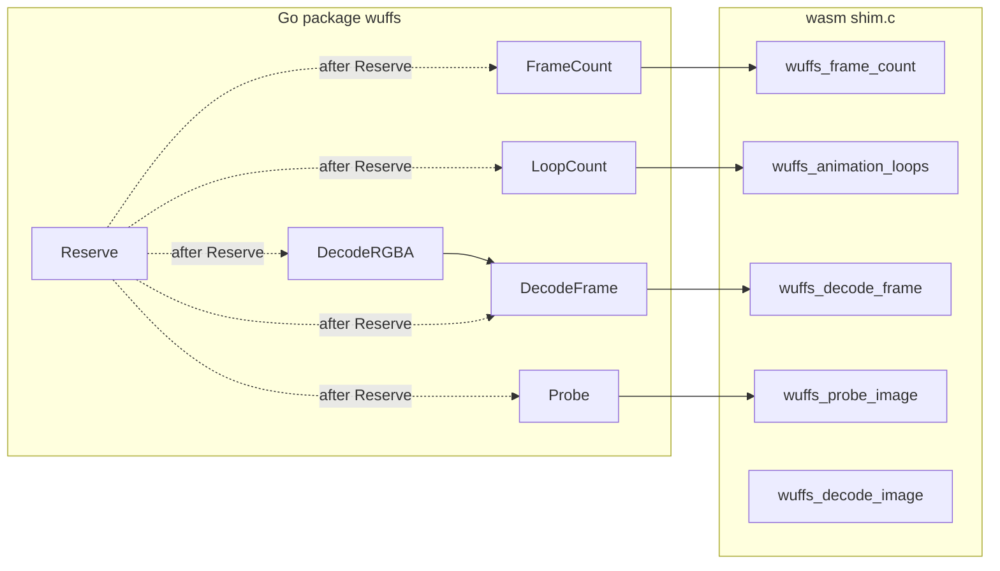

# ANIM-01 — Animation APIs (`FrameCount`, `LoopCount`, `DecodeFrame`)

**Execution protocol:** `plans/pi-runbook.md`

**Execution branch:** `anim-01-animation-apis`

**TDD plan mirror (orchestrator cross-check):** `.pi/tdd-plans/anim-01-animation-apis.yaml`

**Progress file:** `tmp/pi_progress.md`

**Commit authorized:** Yes

**Purpose:** Implement the animation section of `API.md`: exported `Frame`, `Disposal`,
`(*Decoder).FrameCount`, `(*Decoder).LoopCount`, and `(*Decoder).DecodeFrame`; refactor
`DecodeRGBA` to delegate to `DecodeFrame(dst, src, 0)`; extend the wasm guest with
frame-walking and indexed frame decode exports; verify multi-frame behavior on upstream
Wuffs fixtures for GIF and NIE nïA; publish documentation, API-boundary
inventory, architecture diagrams, and roadmap completion evidence.

This plan does not implement `META-01`, package-level animation helpers, or
`DecodeNRGBA` / `DecodeGray` per-frame APIs.

---

## Sources of truth

Read before acting:

1. `AGENTS.md`
2. The user's latest instruction
3. `plans/pi-runbook.md`
4. This plan
5. `GOALS.md`
6. `API.md` (animation types and methods)
7. `plans/api-roadmap.md`, especially `ANIM-01`
8. `HANDOVER.md` (caller-owned `Pix`, explicit `Reserve`, zero-allocation hot path)

If the sources conflict, stop and report the conflict. Preflight verifies `CORE-02`
`Complete` and `ANIM-01` `Ready` in `plans/api-roadmap.md` (STOP on failure).

---

## Verified animation scope (fixed)

Multi-frame integration evidence uses exactly these fixtures copied from
`../wuffs/test/data/` into `testdata/`:

| Fixture                 | Role                                                     |
| ----------------------- | -------------------------------------------------------- |
| `muybridge.gif`         | GIF multi-frame count, loop metadata, per-frame decode   |
| `animated-red-blue.gif` | GIF disposal / bounds / duration oracle                  |
| `animated-red-blue.nia` | NIE nïA multi-frame (extends FORMAT-03 frame-zero limit) |

Still-image regression fixtures (`bricks-nodither.png`, `bricks-color.lossless.webp`,
`bricks-nodither.gif` single-frame oracle) must keep existing behavior:
`FrameCount` returns `1`, `LoopCount` returns `0`, and `DecodeRGBA` golden parity is
unchanged.

PNG and APNG containers remain **documented as first-frame-only** for decode and
registration; ANIM-01 does not add APNG fixtures or advertise PNG multi-frame support.

---

## Product invariants (must hold after every task)

- No CGO. Root package owns the consumer API.
- Caller owns `dst.Pix`, `Rect`, and `Stride`; decode methods never allocate, replace,
  or alias `Pix`.
- Only `Reserve` grows guest scratch; `FrameCount`, `LoopCount`, `DecodeFrame`, and
  `Probe` never auto-grow guest memory.
- `DecodeFrame` writes the indexed frame's own (delta) pixels as straight RGBA into the
  caller buffer only within `Frame.Bounds`; it does not composite prior frames, and it
  does not clear or modify pixels outside `Frame.Bounds`.
- `DecodeRGBA(dst, src)` equals `DecodeFrame(dst, src, 0)` for pixels and returned
  `*Meta` semantics; the `*Frame` value from index `0` is not returned by `DecodeRGBA`.
- Reusable hot path: after `Reserve` and a sized `dst`, successful `DecodeFrame` for
  a fixed index performs zero Go heap allocations (same standard as `DecodeRGBA`).
- Generated `internal/wuffswasm/wuffs.go` is never hand-edited; guest changes run
  `make generate` and commit `wasm/shim.c`, `wasm/wuffs.wasm`, and
  `internal/wuffswasm/wuffs.go` together.

### Host call pattern (`FrameCount`, `LoopCount`, `DecodeFrame`)

- Call `checkSrcCapacity` before every guest export (same as `Probe` / `DecodeRGBA`).
- Copy caller `src` into the wasm src slot (`copySrcToSlot`); exports never read Go heap
  `src` directly.
- Pass scratch offsets from `d.currentLayout` after the last successful `Reserve`:
  `countOutOff`, `loopsOutOff`, `frameMetaOff`, `metaOff`, `srcOff`, `dstOff`.
- Zero the relevant scratch slot(s) before each export (count out, loops out, frame meta,
  decode meta as required).
- These methods never call `memory.Grow` or `Reserve`; undersized guest memory returns
  `ErrDstTooLarge` / `ErrSrcTooLarge` like existing decode paths.
- `Reserve` / `slotTotal` / `requiredMem` must include `hostAnimationScratchBytes` so
  `hostBase` (`countOutOff`) is never below `hostSlotRegionBase`.

---

## Guest export contract (fixed)

Add these C exports in `wasm/shim.c` (names are exact wasm export names):

```c
// wuffs_wasm_frame_meta — written by decode_frame export; zeroed before call.
typedef struct wuffs_wasm_frame_meta {
  int32_t err;
  uint32_t index;
  int32_t bounds_min_x;
  int32_t bounds_min_y;
  int32_t bounds_max_x;
  int32_t bounds_max_y;
  uint64_t duration_flicks;
  uint64_t io_position;
  uint8_t disposal;    // Wuffs animation_disposal 0..2
  uint8_t overwrite;   // 1 = overwrite_instead_of_blend
  uint8_t opaque;      // 1 = opaque_within_bounds
  uint8_t bg_r;
  uint8_t bg_g;
  uint8_t bg_b;
  uint8_t bg_a;
} wuffs_wasm_frame_meta;

// Returns frame count in *count_out (int32) or negative WUFFS_WASM_ERR_* .
int32_t wuffs_frame_count(uint32_t src_off, uint32_t src_len, uint32_t count_out_off);

// Writes uint32 loop count to *loops_out_off using num_animation_loops .
int32_t wuffs_animation_loops(uint32_t src_off, uint32_t src_len, uint32_t loops_out_off);

// Decodes frame `index` (0-based). decode_meta_off is wuffs_wasm_decode_meta;
// frame_meta_off is wuffs_wasm_frame_meta. Decodes into full canvas scratch at
// dst_off with capacity dst_cap (same layout as wuffs_decode_image).
int32_t wuffs_decode_frame(
    uint32_t src_off, uint32_t src_len,
    uint32_t dst_off, uint32_t dst_cap,
    uint32_t decode_meta_off, uint32_t frame_meta_off,
    int32_t index);
```

Implementation rules:

- `wuffs_frame_count` loops `wuffs_base__image_decoder__decode_frame_config` until
  `wuffs_base__note__end_of_data`; counts configs; performs no `decode_frame`.
- `wuffs_animation_loops` calls `decode_image_config` then
  `wuffs_base__image_decoder__num_animation_loops`.
- `wuffs_decode_frame` validates `index` against the frame count; out of range sets
  `WUFFS_WASM_ERR_DECODE` on decode meta.
- `wuffs_decode_frame` advances the decoder to frame `index` (config walk, skipping prior
  frames' pixel data as Wuffs requires) and runs a single `decode_frame` for that index
  into the canvas-sized dst scratch with SRC (replace) blend so the scratch `Bounds` region
  holds the indexed frame's own (delta) pixels. It does not composite prior frames into
  scratch for the purpose of filling `dst`; the host copies only the `Frame.Bounds`
  sub-rectangle from scratch BGRA into caller `dst.Pix` (partial writes; pixels outside
  `Bounds` in `dst` are untouched—matches Task 6 zeroed `Pix` per index).
- Each export rewinds the bump allocator at entry (same as `decode_image` / `probe_image`).
- Flicks-to-`time.Duration` on the host: `time.Duration(flicks) * time.Second / 705600000`.
- `count_out_off` and `loops_out_off` are **not** caller-supplied; the host passes offsets
  derived from `slotLayout` (see Host scratch layout below). Guest reads/writes only within
  those offsets; `count_out_off == 0` or `loops_out_off == 0` is rejected like `meta_off == 0`.

---

## Host scratch layout (animation exports)

Sizes must match the C structs in `wasm/shim.c`:

| Slot                | Bytes | C type / role                                   |
| ------------------- | ----- | ----------------------------------------------- |
| Frame count out     | 4     | `int32_t` written by `wuffs_frame_count`        |
| Animation loops out | 4     | `uint32_t` written by `wuffs_animation_loops`   |
| Frame meta          | 48    | `wuffs_wasm_frame_meta` (8-byte-aligned struct) |

Define in `memory.go` (with existing `metaSlotBytes`):

- `frameCountOutSlotBytes = 4`
- `animationLoopsOutSlotBytes = 4`
- `frameMetaSlotBytes = 48`
- `hostAnimationScratchBytes = align8(frameCountOutSlotBytes + animationLoopsOutSlotBytes + frameMetaSlotBytes)` → **56**

Extend `slotLayout` with `countOutOff`, `loopsOutOff`, and `frameMetaOff`. In `computeLayout`,
place slots at the end of linear memory in this **exact** order (low → high address):

**animation scratch → decode meta → src → dst**

1. `totalSlots := slotTotal(dstBytes, srcBytes)` where `slotTotal` sums
   `hostAnimationScratchBytes + metaSlotBytes + srcBytes + dstBytes` (8-byte aligned).
2. `hostBase := memSize - totalSlots` (clamp to `hostSlotRegionBase` as today).
3. `countOutOff := hostBase` (same as `hostBase`; start of animation scratch).
4. `loopsOutOff := countOutOff + frameCountOutSlotBytes` (4).
5. `frameMetaOff := countOutOff + 8` (8-byte-aligned start of `wuffs_wasm_frame_meta`; 48 bytes).
6. `metaOff := hostBase + hostAnimationScratchBytes`.
7. `srcOff := metaOff + metaSlotBytes`; `dstOff := srcOff + srcBytes`.

`Reserve` must use the same `slotTotal` when computing `requiredMem` / page growth.
`FrameCount`, `LoopCount`, and `DecodeFrame` pass these offsets to the guest; zero each
scratch slot before the corresponding export call.

---

## Execution control

- Use only the preconfigured Pi subagents `worker` and `reviewer` through
  `plans/pi-runbook.md`.
- The orchestrator only orchestrates; it does not edit product code, run tests, or commit.
- Before execution, `plans/api-roadmap.md` must list this plan path and `ANIM-01` status
  `Ready`. If not, stop.
- Branch: `anim-01-animation-apis`. Create with
  `git switch -c anim-01-animation-apis` only when on `main`, the branch does not exist,
  and the working tree and index are clean. Any other branch state stops for user direction.
- Complete and review each task before the next task starts.
- Each committing task: worker implements, runs Verify, writes
  `tmp/commit_message.txt`, reviewer approves, worker commits with
  `git commit -F tmp/commit_message.txt`, worker appends hash to `tmp/pi_progress.md`.
- Follow the runbook three-attempt limit per task.

---

## Executor STOP gates (mandatory)

**Global rules:** `plans/pi-runbook.md` standing constraint 13; **Plan executor STOP
(zero deviation)** in the same runbook.

Executors **must not** edit this plan file. On any trigger below (or any global rule):
**STOP**, message the user (task id, evidence), **no commit**, **no next task** until
written user direction.

| # | Trigger                                                                                               | Executor action                       |
| - | ----------------------------------------------------------------------------------------------------- | ------------------------------------- |
| 1 | Preflight check fails                                                                                 | STOP — notify user                    |
| 2 | Plan step contradicts runtime, libs, or tests                                                         | STOP — notify user                    |
| 3 | Verify fails for reason not explained by current RED/GREEN step                                       | STOP — notify user                    |
| 4 | Required file not in task whitelist                                                                   | STOP — notify user                    |
| 5 | `make generate` changes files outside `wasm/shim.c`, `wasm/wuffs.wasm`, `internal/wuffswasm/wuffs.go` | STOP — notify user                    |
| 6 | Upstream fixture missing at `../wuffs/test/data/<name>`                                               | STOP — notify user                    |
| 7 | Wuffs guest API cannot implement frame index without undocumented behavior                            | STOP — notify user with shim evidence |

---

## Preflight — baseline and roadmap gate

### Worker instructions

1. **Gate:** working tree and index must be clean before any preflight step (no staged or
   unstaged product changes). If not clean, **STOP** for user direction.
2. Run the preflight commands below; write output to
   `tmp/anim-01-animation-apis/preflight.log`. If the roadmap gate commands fail, **STOP**
   (executor STOP gate 1)—do not copy fixtures or change roadmap status.
3. Copy `plans/api-roadmap.md` to
   `tmp/anim-01-animation-apis/api-roadmap.pre-execution.md` and
   `chmod a-w` the copy.
4. Copy all three verified animation fixtures from `../wuffs/test/data/` into `testdata/`
   (create `testdata/` entries; update `testdata/README` with one-line provenance per file):
   `muybridge.gif`, `animated-red-blue.gif`, `animated-red-blue.nia`.
5. Record `BASELINE_HEAD`, `BASELINE_PI_SHA256`, `BASELINE_ROADMAP_SHA256`, and
   `BASELINE_ROADMAP_SNAPSHOT` in `tmp/pi_progress.md` (create the file).
6. Change only the `ANIM-01` row in `plans/api-roadmap.md`: status `Ready` →
   `In progress`; plan file `plans/anim-01-animation-apis.md`.
7. Commit authorized: **no** (preflight only). Expect **uncommitted** changes after
   preflight (fixtures, `testdata/README`, roadmap status, `tmp/pi_progress.md`) until
   Task 1 commits.

### Allowed files

- `testdata/muybridge.gif`, `testdata/animated-red-blue.gif`, `testdata/animated-red-blue.nia`
  (new copies from upstream)
- `testdata/README` (provenance lines for the three animation fixtures)
- `plans/api-roadmap.md` (`ANIM-01` status `Ready` → `In progress` only)
- `tmp/pi_progress.md`, `tmp/anim-01-animation-apis/` (baseline evidence and
  `preflight.log`; gitignored — write but **do not stage**)

### Preflight commands

```bash
grep '`CORE-02`' plans/api-roadmap.md | grep -q 'Complete'
grep '`ANIM-01`' plans/api-roadmap.md | grep -q 'Ready'
git branch --show-current
git rev-parse HEAD
git status --short
git diff --cached --name-only
git diff --name-only
test -f ../wuffs/test/data/muybridge.gif
test -f ../wuffs/test/data/animated-red-blue.gif
test -f ../wuffs/test/data/animated-red-blue.nia
tar --sort=name --mtime=@0 --owner=0 --group=0 --numeric-owner -cf - .pi | sha256sum
sha256sum tmp/anim-01-animation-apis/api-roadmap.pre-execution.md
```

### Preflight acceptance

- `CORE-02` is `Complete` and `ANIM-01` is `Ready` in `plans/api-roadmap.md` (verified by
  preflight grep commands).
- All three upstream fixtures exist.
- All three animation fixtures are present under `testdata/` on disk (copied in preflight step 4)
  before Task 3 runs.
- `ANIM-01` is `In progress` with this plan path.
- `tmp/pi_progress.md` contains baseline hashes.
- Working tree and index were clean before preflight started.
- After preflight, uncommitted product changes remain until Task 1’s commit (not a STOP).

---

## Task 1 — Export `Frame` and `Disposal` (host-only TDD)

### Allowed files

- `frame.go` (new)
- `frame_declaration_test.go` (new)
- `api_boundary_test.go`
- `testdata/muybridge.gif`, `testdata/animated-red-blue.gif`, `testdata/animated-red-blue.nia`
- `testdata/README` (provenance lines for the three animation fixtures from preflight)
- `plans/api-roadmap.md` (no status change)

### RED

Add `TestUnitFrameAndDisposalDeclaration` in `frame_declaration_test.go` using
`go/parser` (same style as `format_gif_declaration_test.go`) to require:

- Exported type `Frame` with exported fields: `Index`, `Bounds`, `Duration`,
  `Disposal`, `Opaque`, `Overwrite`, `Background`, `IOPosition`.
- Exported type `Disposal` as `uint8`.
- Exported constants `DisposalNone`, `DisposalRestoreBackground`,
  `DisposalRestorePrevious` with values `0`, `1`, `2`.
- `TestUnitPublicAPIBoundary` updated to include types, constants, and `Frame` fields
  in its inventory (methods come in later tasks).

### GREEN

Implement `frame.go` with godoc matching `API.md` semantics (flicks note on `Duration`).

### Verify

```bash
go test -run '^TestUnitFrameAndDisposalDeclaration$' -count=1 -v .
go test -run '^TestUnitPublicAPIBoundary$' -count=1 -v .
make format-check
go build ./...
```

FORBIDDEN before commit: `make test`, `make test-race`, `make cover`, `go test ./...`, or any test command not listed above.

### Acceptance

- Declaration tests pass; no wasm or generated file changes; animation fixtures committed.

---

## Task 2 — Guest `wuffs_frame_count` and host `FrameCount` (still image)

### Allowed files

- `wasm/shim.c`
- `wasm/wuffs.wasm`
- `internal/wuffswasm/wuffs.go`
- `memory.go` (host animation scratch layout per **Host scratch layout**)
- `decoder.go`
- `errors.go` (add `FrameCount` guest error mapping only when a new `WUFFS_WASM_ERR_*`
  constant is introduced; do not refactor existing mappings)
- `frame_count_integration_test.go` (new)
- `export_test.go` (extend `GuestMemoryState` / `CaptureGuestMemoryState` for animation scratch)
- `memory_test.go`, `memory_reserve_test.go` (always update layout offset assertions for
  animation scratch fields in `slotLayout`)

### RED

`TestIntegrationFrameCountStillImage` in `frame_count_integration_test.go`:

- `FrameCount` on `bricks-nodither.png` returns `(1, nil)`.
- `FrameCount` on `bricks-nodither.gif` returns `(1, nil)`.
- Empty `src` → `ErrDecode`; `len(src)` over reserved cap → `ErrSrcTooLarge`.
- Guest memory and layout unchanged (use `CaptureGuestMemoryState` / `assertGuestMemoryPreserved`).

### GREEN

1. Extend `memory.go` / `slotLayout` with `countOutOff`, `loopsOutOff`, `frameMetaOff`, and
   scratch total per **Host scratch layout**.
2. Extend `GuestMemoryState` and `CaptureGuestMemoryState` in `export_test.go` with
   `CountOutOff`, `LoopsOutOff`, and `FrameMetaOff` so `assertGuestMemoryPreserved` covers
   animation scratch layout.
3. Implement `wuffs_frame_count` in `wasm/shim.c`; host passes `lay.countOutOff`.
4. Run `make generate`; commit generated trio.
5. Add `(*Decoder).FrameCount` in `decoder.go` with `checkSrcCapacity`; map guest errors.

### Verify

```bash
go test -run '^TestIntegrationFrameCountStillImage$' -count=1 -v .
go test -run '^TestUnitMemoryLayout$' -count=1 -v .
go test -run '^TestReserveGrowsOnlyRequestedSlotCapacity$' -count=1 -v .
make format-check
go build ./...
git diff --exit-code -- wasm/wuffs_config.h
```

FORBIDDEN before commit: `make test`, `make test-race`, `make cover`, `go test ./...`, or any test command not listed above.

### Acceptance

- Still-image frame count is `1`; guest exports present in generated bindings; memory layout
  unit tests pass with animation scratch in `slotLayout`.

---

## Task 3 — Guest `wuffs_animation_loops` and host `LoopCount`

### Allowed files

- `wasm/shim.c`, `wasm/wuffs.wasm`, `internal/wuffswasm/wuffs.go`
- `decoder.go`
- `loop_count_integration_test.go` (new)

### RED

`TestIntegrationLoopCountCharacterization`:

- Still fixtures `testdata/bricks-nodither.png`, `testdata/bricks-color.lossless.webp`, and
  `testdata/bricks-nodither.gif`: `LoopCount` returns `(0, nil)`.
- `muybridge.gif`: `LoopCount` returns Wuffs loop metadata (assert exact `uint32` from
  a one-time recorded constant in the test file comment and literal).
- Empty `src` → `ErrDecode`; oversize `src` → `ErrSrcTooLarge`.
- Guest memory preserved on success paths.

### GREEN

Implement `wuffs_animation_loops` in `wasm/shim.c`; host passes `lay.loopsOutOff`.
Implement `(*Decoder).LoopCount`; run `make generate`.

### Verify

```bash
go test -run '^TestIntegrationLoopCountCharacterization$' -count=1 -v .
make format-check
go build ./...
```

FORBIDDEN before commit: `make test`, `make test-race`, `make cover`, `go test ./...`, or any test command not listed above.

### Acceptance

- Loop count matches Wuffs for `muybridge.gif` and zero for still fixtures.

---

## Task 4 — Guest `wuffs_decode_frame` and host `DecodeFrame` core

### Allowed files

- `wasm/shim.c`, `wasm/wuffs.wasm`, `internal/wuffswasm/wuffs.go`
- `decoder.go`
- `convert.go`
- `decode_frame_integration_test.go` (new)
- Do not edit `meta.go`; read decode meta and populate `lastMeta` in `decoder.go` only.

### RED

`TestIntegrationDecodeFrameCore` on `bricks-nodither.gif`:

- After `Probe` + `Reserve`, `DecodeFrame(dst, src, 0)` returns non-nil `*Frame` with
  `Index == 0`, `Bounds` equal to full canvas `(0,0)-(160,120)`, duration `0` for still
  GIF, disposal `DisposalNone`.
- Pixels in `dst` match existing PNG oracle (same assertion as `decode_gif_integration_test.go`).
- `Pix` pointer/len/cap/`Rect`/`Stride` identity preserved.
- `index == 1` with `FrameCount == 1` → `errors.Is(err, ErrDecode)`.
- Out-of-range negative index → `ErrDecode`.
- On `animated-red-blue.gif` (preflight fixture): `FrameCount == 4`; `DecodeFrame(dst, src, 1)`
  succeeds with `Frame.Index == 1`, non-full-canvas `Bounds`, and pixels inside `Bounds` matching
  a one-time recorded CRC constant in the test file (sub-rect oracle before Task 6 manifest).

### GREEN

1. Implement `wuffs_decode_frame` for **every valid frame index** (full frame walk + indexed
   decode, not index-`0` only).
2. Host `DecodeFrame` validates `dst` like `DecodeRGBA`, calls guest with `lay.frameMetaOff`,
   maps `wuffs_wasm_frame_meta` → `Frame`, copies BGRA scratch into `dst.Pix` within
   `Frame.Bounds` via new `convertBGRAToRGBARegion` in `convert.go`.
3. Populate reusable `lastMeta` from decode meta on success (same fields as `DecodeRGBA`).
4. Store reusable `lastFrame` on `Decoder` (same allocation pattern as `lastMeta`).
5. Run `make generate`.

### Verify

```bash
go test -run '^TestIntegrationDecodeFrameCore$' -count=1 -v .
make format-check
go build ./...
```

FORBIDDEN before commit: `make test`, `make test-race`, `make cover`, `go test ./...`, or any test command not listed above.

### Acceptance

- `DecodeFrame` index `0` matches prior `DecodeRGBA` oracle on still GIF; index `1` on
  `animated-red-blue.gif` passes; `lastMeta` populated on success.

---

## Task 5 — Refactor `DecodeRGBA` through `DecodeFrame(0)`

### Allowed files

- `decoder.go`
- `decode_rgba_frame_equivalence_test.go` (new)
- `decoder_test.go`
- `decode_gif_integration_test.go`
- `decode_webp_integration_test.go`
- `format03_contract_test.go` (do not edit unless `go build ./...` fails on this file;
  then apply the minimal import or helper fix only)

### RED

`TestIntegrationDecodeRGBAFrameZeroEquivalence` (same package `wuffs`, in
`decode_rgba_frame_equivalence_test.go`):

- For PNG and GIF fixtures, `DecodeRGBA` and `DecodeFrame(..., 0)` yield identical
  `dst.Pix` CRC.
- On the same `*Decoder`, after each call compare `d.lastMeta` field-for-field (same package;
  do **not** add an `export_test.go` `lastMeta` helper).
- `DecodeRGBA` does not return `*Frame` (compile-time API unchanged).

### GREEN

Implement `DecodeRGBA` as `DecodeFrame(dst, src, 0)` then return `&d.lastMeta` only.

### Verify

```bash
go test -run '^TestIntegrationDecodeRGBAFrameZeroEquivalence$' -count=1 -v .
go test -run 'GIFDecodeCharacterization|WebPDecodeCharacterization' -count=1 -v .
make format-check
go build ./...
```

FORBIDDEN before commit: `make test`, `make test-race`, `make cover`, `go test ./...`, or any test command not listed above.

### Acceptance

- Existing GIF/WebP characterization tests pass; equivalence test passes.

---

## Task 6 — GIF multi-frame characterization

### Allowed files

- `testdata/README` (add provenance lines for `gif.animation.golden.manifest` and the gen script)
- `testdata/gif.animation.golden.manifest` (new)
- `animation_gif_integration_test.go` (new)
- `scripts/gen_animation_golden.go` (new; writes animation golden manifests)

### RED

`TestIntegrationGIFAnimationCharacterization`:

- `FrameCount(muybridge.gif)` equals `15` (Wuffs standard fixture).
- `LoopCount(muybridge.gif)` matches Task 3 literal.
- For each frame index `0..14`, use a **fresh** `image.RGBA` with zeroed `Pix` (new buffer or
  explicit zero fill) before `DecodeFrame`; assert per-frame CRC against
  `testdata/gif.animation.golden.manifest` on that canvas.
- `animated-red-blue.gif`: `FrameCount == 4`; frame `1` has non-full-canvas `Bounds`;
  exercise `Disposal`, `Overwrite`, and non-zero `Duration` with table-driven expected
  values recorded from the first green run in test constants.
- Each successful decode preserves caller `Pix` identity and guest memory.

### GREEN

Implement `scripts/gen_animation_golden.go`; run `go run ./scripts/gen_animation_golden.go` to
generate `testdata/gif.animation.golden.manifest`; implement tests against that manifest.
(Fixtures already under `testdata/` from preflight / Task 1.)

### Verify

```bash
go test -run '^TestIntegrationGIFAnimationCharacterization$' -count=1 -v .
make format-check
go build ./...
```

FORBIDDEN before commit: `make test`, `make test-race`, `make cover`, `go test ./...`, or any test command not listed above.

### Acceptance

- GIF multi-frame golden manifest committed; all subtests pass.

---

## Task 8 — NIE nïA multi-frame characterization

### Allowed files

- `testdata/nie.animation.golden.manifest` (new)
- `animation_nie_integration_test.go` (new)
- `decode_nie_integration_test.go` (update frame-zero tests to remain valid)
- `testdata/README`
- `testdata/nie.golden.manifest` (read-only in this task—do not edit the manifest)
- `scripts/gen_animation_golden.go`

### RED

`TestIntegrationNIEAnimationCharacterization`:

- `FrameCount(animated-red-blue.nia) == 4`.
- Per-frame decode CRCs against `nie.animation.golden.manifest`.
- Subtest `frame-0` (or equivalent): `DecodeFrame` index `0` on `animated-red-blue.nia`
  with a zeroed `dst.Pix` canvas; CRC of full `dst` (or documented oracle region) must
  match the `animated-red-blue.nia` line in existing `testdata/nie.golden.manifest`
  (proves frame-zero still matches FORMAT-03 NIE evidence).
- Frame-zero behavior remains compatible with existing NIE still tests (`go test -run NIE`).
- **Manifest rule:** `nie.golden.manifest` must not be modified. If a future task needs it
  whitelisted, a test must first prove the on-disk manifest is unchanged; this plan forbids
  manifest edits in Task 8.

### GREEN

Extend `scripts/gen_animation_golden.go` to emit
`testdata/nie.animation.golden.manifest`; run `go run ./scripts/gen_animation_golden.go`;
implement test; adjust NIE docs strings in tests only.

### Verify

```bash
go test -run '^TestIntegrationNIEAnimationCharacterization$' -count=1 -v .
go test -run 'NIE' -count=1 -v .
make format-check
go build ./...
```

FORBIDDEN before commit: `make test`, `make test-race`, `make cover`, `go test ./...`, or any test command not listed above.

### Acceptance

- NIE nïA four-frame path verified; frame-0 CRC matches `nie.golden.manifest`; prior NIE
  tests pass; `nie.golden.manifest` unchanged on disk.

---

## Task 9 — Error, dst, and concurrency characterization

### Allowed files

- `decode_frame_errors_integration_test.go` (new)
- `decoder.go`
- `wasm/shim.c`, `wasm/wuffs.wasm`, `internal/wuffswasm/wuffs.go` (do not edit unless
  `TestIntegrationDecodeFrameErrors` still fails after host-only fixes; then adjust
  `wuffs_decode_frame` out-of-range index handling in `wasm/shim.c` only, run
  `make generate`, commit the generated trio)

### RED

`TestIntegrationDecodeFrameErrors`:

- Truncated `muybridge.gif` probe succeeds; `DecodeFrame` fails with `ErrDecode`; `dst`
  bytes unchanged.
- `ErrBadImage` / `ErrDstTooSmall` paths mirror `DecodeRGBA` table tests.
- Two goroutines, two `Decoder` instances, concurrent `DecodeFrame` on different indices:
  no panic; correct per-index CRC (from Task 6 manifest).

### GREEN

Production fixes only to satisfy tests.

### Verify

```bash
go test -run '^TestIntegrationDecodeFrameErrors$' -count=1 -v .
make format-check
go build ./...
```

FORBIDDEN before commit: `make test`, `make test-race`, `make cover`, `go test ./...`, or any test command not listed above.

### Acceptance

- Error and dst contracts match `API.md`; concurrent decoders safe.

---

## Task 10 — Zero-allocation reusable `DecodeFrame`

### Allowed files

- `decode_frame_alloc_integration_test.go` (new)
- `decoder.go`

### RED

`TestIntegrationDecodeFrameAllocsPerRun`:

- `NewRGBA` and `Reserve` outside loop; repeated `DecodeFrame(dst, src, 0)` on
  `bricks-nodither.png` reports `0` allocs/op after warmup (same pattern as
  `TestIntegrationDecodeRGBA_AllocsPerRun`).
- `FrameCount` and `LoopCount` each report `0` allocs/op on a reserved decoder for a
  fixed `muybridge.gif` source.

### GREEN

Eliminate per-call allocations on success paths (reuse `lastFrame` / `lastMeta`).

### Verify

```bash
go test -run '^TestIntegrationDecodeFrameAllocsPerRun$' -count=1 -v .
make format-check
go build ./...
```

FORBIDDEN before commit: `make test`, `make test-race`, `make cover`, `go test ./...`, or any test command not listed above.

### Acceptance

- Allocs tests pass.

---

## Task 11 — Public API boundary and method godoc

### Allowed files

- `api_boundary_test.go`
- `decoder.go`, `frame.go` (godoc only)

### RED

Update `TestUnitPublicAPIBoundary` to require:

- Types: `Frame`, `Disposal` (existing), plus methods `FrameCount`, `LoopCount`,
  `DecodeFrame` on `Decoder`.
- Constants: `DisposalNone`, `DisposalRestoreBackground`, `DisposalRestorePrevious`.

Do **not** change `documentation_contract_integration_test.go` in this task.

### GREEN

Add or adjust godoc on `FrameCount`, `LoopCount`, and `DecodeFrame` to match `API.md` semantics.

### Verify

```bash
go test -run '^TestUnitPublicAPIBoundary$' -count=1 -v .
make format-check
go build ./...
```

FORBIDDEN before commit: `make test`, `make test-race`, `make cover`, `go test ./...`, or any test command not listed above.

### Acceptance

- Boundary inventory includes animation surface; no documentation-contract test changes.

---

## Task 12 — Publish documentation and architecture diagrams

### Allowed files

- `README.md`
- `API.md` (verified subsets and limitations only)
- `testdata/README`
- `docs/DEVELOPMENT.md`
- `documentation_contract_integration_test.go`
- `plans/api-roadmap.md` (`ANIM-01` status → `Review` only)

### RED

Extend `TestIntegrationVerifiedFormatDocumentationInventory` to require animation inventory
assertions (README and `API.md` mention animation APIs; NIE scope text changes from
frame-zero-only to nïA multi-frame verified; GIF animation no longer listed as
"first frame only" without documenting `DecodeFrame`; PNG remains first-frame-only;
`ANIM-01` `In progress` or `Review` in roadmap).

### GREEN

Implement the required documentation content below; update
`TestIntegrationVerifiedFormatDocumentationInventory` expectations to match the
documented wording exactly.

### Required documentation content

1. **README.md** — Replace "first frame only" limitation with animation API summary;
   document verified multi-frame formats (GIF, NIE nïA); keep PNG as
   first-frame-only; show `FrameCount` / `DecodeFrame` call sequence in a code example.
2. **API.md** — Update verified subsets: NIE includes nïA multi-frame; WebP remains
   still-only (lossless/lossy, no alpha, no animation); add animation subsection under
   verified scope.
3. **testdata/README** — List new fixtures and golden manifests.
4. **docs/DEVELOPMENT.md** — Extend module layout and wasm export list; add **mermaid**
   diagram of host/guest flow including `wuffs_frame_count`, `wuffs_animation_loops`,
   `wuffs_decode_frame` (replace the prior two-export-only description).

### Mermaid diagram (exact required content in `docs/DEVELOPMENT.md`)



### Verify

```bash
go test -run '^TestIntegrationVerifiedFormatDocumentationInventory$' -count=1 -v .
make format-check
make lint
```

FORBIDDEN before commit: `make test`, `make test-race`, `make cover`, `go test ./...`, or any test command not listed above.

### Acceptance

- Doc contract test passes; mermaid block present verbatim in `docs/DEVELOPMENT.md`;
  roadmap `ANIM-01` is `Review`.

---

## Task 13 — Final verification and completion evidence

### Allowed files

- `plans/api-roadmap.md` (`ANIM-01` status `Review` → `Complete` only — **only path staged
  for commit**)
- `tmp/pi_progress.md`, `tmp/anim-01-animation-apis/final-gates.log` (append log path and
  write gate output; gitignored — **do not stage**)

### Worker instructions

1. Run every command in **Verify** below; save combined log to
   `tmp/anim-01-animation-apis/final-gates.log`.
2. Change only `ANIM-01` status `Review` → `Complete` in `plans/api-roadmap.md`.
3. Commit authorized: **yes** (stage and commit `plans/api-roadmap.md` only; record
   `tmp/anim-01-animation-apis/final-gates.log` path in `tmp/pi_progress.md`).

### Verify

```bash
make format-check
make lint
make test
make test-race
go build ./...
go doc -all .
go test -run 'Frame|Loop|DecodeFrame|DecodeRGBAFrameZero|GIFAnimation|NIEAnimation|PublicAPIBoundary|VerifiedFormatDocumentation' -count=1 -v .
git status --porcelain --untracked-files=all
git diff --exit-code main...HEAD -- internal/wuffswasm/wuffs.go wasm/shim.c wasm/wuffs.wasm
```

FORBIDDEN before commit: `make test`, `make test-race`, `make cover`, `go test ./...`, or any test command not listed above.

### Final acceptance

- All commands pass.
- `ANIM-01` is `Complete` with plan path `plans/anim-01-animation-apis.md`.
- `tmp/pi_progress.md` lists every task commit hash.
- Working tree clean except ignored `tmp/` artifacts.

---

## Completion report

After Task 13 reviewer approval, the orchestrator reports:

1. Branch `anim-01-animation-apis` and final HEAD.
2. Guest exports added and generated binding digest.
3. Fixture and golden manifest list.
4. Animation integration test names and pass evidence.
5. Zero-allocation test evidence.
6. Documentation and mermaid location.
7. Roadmap `ANIM-01` `Complete`.
8. Full `make test` / `make test-race` log path.

Stop after reporting. Do not push or merge unless the user instructs.

---

## Execution prompt (for Cursor Agent)

```text
Execute plans/anim-01-animation-apis.md Tasks Preflight through 13 in order.
Follow plans/pi-runbook.md (test budget, commits, format).
Obey this plan's ## Executor STOP gates (mandatory) and pi-runbook standing constraint 13.
Progress file: tmp/pi_progress.md.
Do not push unless I instruct.
Begin with Preflight.
```
